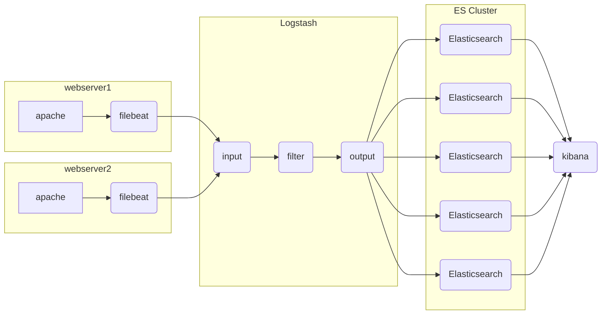

# ELK日志分析平台

## ELK架构图例




## Elasticsearch 安装

###### 在跳板机上配置 yum 仓库

拷贝云盘 rpm-package/elk 目录到跳板机

```shell
[root@ecs-proxy ~]# cp -a elk /var/ftp/localrepo/elk
[root@ecs-proxy elk]# cd /var/ftp/localrepo/
[root@ecs-proxy localrepo]# createrepo --update .
```

###### 购买 5 台云主机 

1核1G即可 (es-0001 ... es-0005)
192.168.1.41  ... 192.168.1.45

###### 单机安装

```shell
[root@es-0001 ~]# vim /etc/hosts
192.168.1.41	es-0001
[root@es-0001 ~]# yum install -y java-1.8.0-openjdk elasticsearch
[root@es-0001 ~]# vim /etc/elasticsearch/elasticsearch.yml
54：  network.host: 0.0.0.0
[root@es-0001 ~]# systemctl enable --now elasticsearch
[root@es-0001 ~]# curl http://192.168.1.41:9200/
{
  "name" : "War Eagle",
  "cluster_name" : "elasticsearch",
  "version" : {
    "number" : "2.3.4",
    "build_hash" : "e455fd0c13dceca8dbbdbb1665d068ae55dabe3f",
    "build_timestamp" : "2016-06-30T11:24:31Z",
    "build_snapshot" : false,
    "lucene_version" : "5.5.0"
  },
  "tagline" : "You Know, for Search"
}
```

