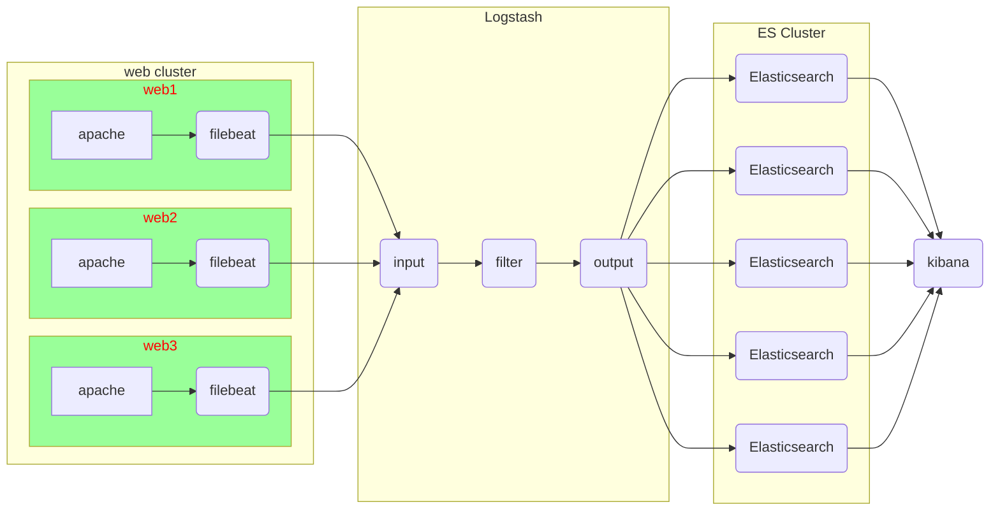

# ELK日志分析平台

## ELK架构图例



#### logstash安装

###### 购买云主机 

| 主机     | IP地址       | 配置          |
| -------- | ------------ | ------------- |
| logstash | 192.168.1.47 | 最低配置2核2G |
| web      | 192.168.1.48 | 最低配置1核1G |

###### web云主机安装

```shell
[root@web ~]# yum install -y httpd
[root@web ~]# systemctl enable --now httpd
[root@web ~]# echo "hello world" >/var/www/html/info.html
[root@web ~]# curl http://192.168.1.48/info.html
```

###### logstash云主机安装

```shell
[root@logstash ~]# vim /etc/hosts
192.168.1.41	es-0001
192.168.1.42	es-0002
192.168.1.43	es-0003
192.168.1.44	es-0004
192.168.1.45	es-0005
192.168.1.47	logstash
[root@logstash ~]# yum install -y java-1.8.0-openjdk logstash
[root@logstash ~]# touch /etc/logstash/logstash.conf
```

###### 基础配置样例

```shell
[root@logstash ~]# vim /etc/logstash/logstash.conf
input { 
  stdin {}
}
filter{ }
output{ 
  stdout{}
}
[root@logstash ~]# /opt/logstash/bin/logstash -f /etc/logstash/logstash.conf
```

###### 插件与调试格式

使用json格式字符串测试  {"a":"1", "b":"2","c":"3"}

```shell
[root@logstash ~]# vim /etc/logstash/logstash.conf
input { 
  stdin { codec => "json" }
}
filter{ }
output{ 
  stdout{ codec => "rubydebug" }
}
[root@logstash ~]# /opt/logstash/bin/logstash -f /etc/logstash/logstash.conf
```

官方手册地址

https://www.elastic.co/guide/en/logstash/current/index.html

###### input之file插件

```shell
[root@logstash ~]# vim /etc/logstash/logstash.conf
input { 
  file {
    path => ["/tmp/c.log"]
    type => "test"
    start_position => "beginning"
    sincedb_path => "/var/lib/logstash/sincedb"
  }
}
filter{ }
output{ 
  stdout{ codec => "rubydebug" }
}
[root@logstash ~]# rm -rf /root/.sincedb_*
[root@logstash ~]# /opt/logstash/bin/logstash -f /etc/logstash/logstash.conf
```

