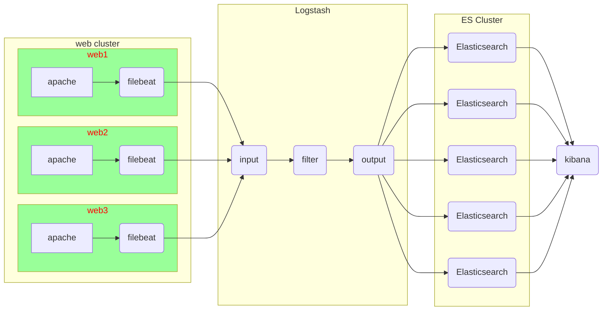

# ELK日志分析平台

## ELK架构图例

```mermaid
graph LR
subgraph web cluster
  subgraph web1
    H1[apache] --> F1(filebeat)
  end
  subgraph web2
    H2[apache] --> F2(filebeat)
  end
  subgraph web3
    H3[apache] --> F3(filebeat)
  end
  style web1 color:#ff0000,fill:#99ff99
  style web2 color:#ff0000,fill:#99ff99
  style web3 color:#ff0000,fill:#99ff99
end
F1 --> A1
F2 --> A1
F3 --> A1
subgraph Logstash
  A1(input) --> A2(filter) --> A3(output)
end
subgraph ES Cluster
  ES1(Elasticsearch)  
  ES2(Elasticsearch)
  ES3(Elasticsearch)
  ES4(Elasticsearch)
  ES5(Elasticsearch)
end
A3 --> ES1
A3 --> ES2
A3 --> ES3
A3 --> ES4
A3 --> ES5
ES1 --> K(kibana)
ES2 --> K
ES3 --> K
ES4 --> K
ES5 --> K
```

#### logstash安装

###### 购买云主机 

| 主机     | IP地址       | 配置          |
| -------- | ------------ | ------------- |
| logstash | 192.168.1.47 | 最低配置2核2G |

