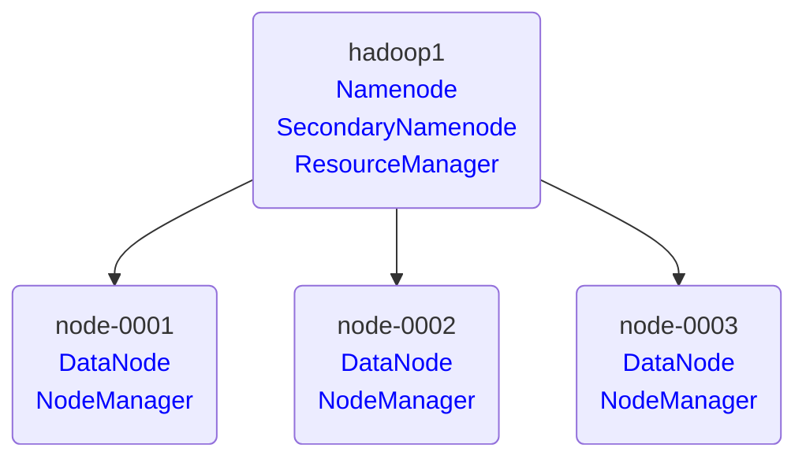

# Hadoop -- 02

## Hadoop集群管理

#### 集群架构图例




#### 重新初始化集群

​    警告：<font color=ff0000>该方法会丢失所有数据</font>

​    1、停止集群  /usr/local/hadoop/sbin/stop-all.sh
​    2、删除所有节点的  /var/hadoop/*
​    3、在 hadoop1 上重新格式化 /usr/local/hadoop/bin/hdfs namenode -format
​    4、启动集群  /usr/local/hadoop/sbin/start-all.sh

```shell
[root@hadoop1 ~]# /usr/local/hadoop/sbin/stop-all.sh
[root@hadoop1 ~]# for i in hadoop1 node-{0001..0003};do
                      ssh ${i} 'rm -rf /var/hadoop/*'
                  done
[root@hadoop1 ~]# /usr/local/hadoop/bin/hdfs namenode -format
[root@hadoop1 ~]# /usr/local/hadoop/sbin/start-all.sh
```


