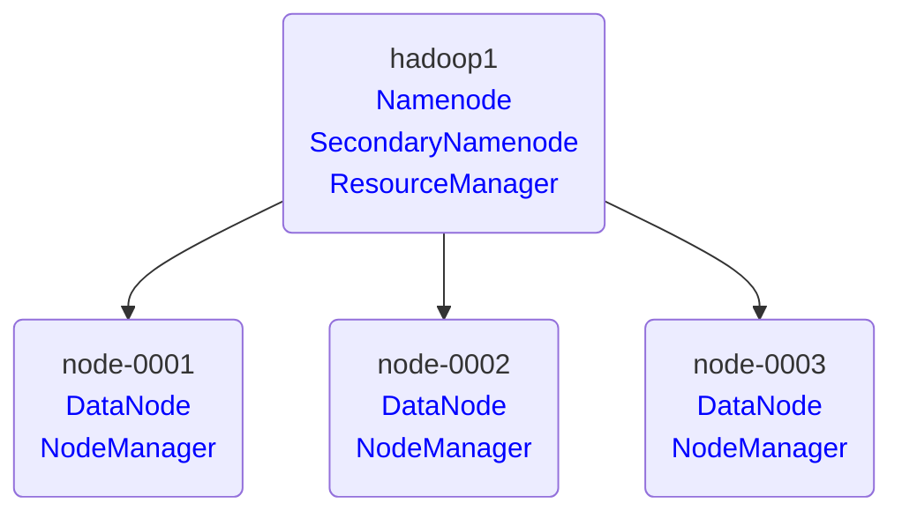

# Hadoop -- 02

## Hadoop集群管理

#### 集群架构图例




#### 重新初始化集群

​    警告：<font color=ff0000>该方法会丢失所有数据</font>

​    1、停止集群  /usr/local/hadoop/sbin/stop-all.sh
​    2、删除所有节点的  /var/hadoop/*
​    3、在 hadoop1 上重新格式化 /usr/local/hadoop/bin/hdfs namenode -format
​    4、启动集群  /usr/local/hadoop/sbin/start-all.sh

```shell
[root@hadoop1 ~]# /usr/local/hadoop/sbin/stop-all.sh
[root@hadoop1 ~]# for i in hadoop1 node-{0001..0003};do
                      ssh ${i} 'rm -rf /var/hadoop/*'
                  done
[root@hadoop1 ~]# /usr/local/hadoop/bin/hdfs namenode -format
[root@hadoop1 ~]# /usr/local/hadoop/sbin/start-all.sh
```

#### 增加新的节点

###### 购买云主机 

| 主机    | IP地址       | 配置          |
| ------- | ------------ | ------------- |
| newnode | 192.168.1.54 | 最低配置2核2G |

###### 新节点安装

在 hadoop1 上执行

```shell
[root@hadoop1 ~]# ssh-copy-id -i /root/.ssh/id_rsa.pub 192.168.1.54
[root@hadoop1 ~]# vim /etc/hosts
192.168.1.50    hadoop1
192.168.1.51    node-0001
192.168.1.52    node-0002
192.168.1.53    node-0003
192.168.1.54    newnode
[root@hadoop1 ~]# for i in node-{0001..0003} newnode;do
                      rsync -av /etc/hosts ${i}:/etc/
                  done
[root@hadoop1 ~]# rsync -aXSH /usr/local/hadoop newnode:/usr/local/
```

在 newnode 节点执行

```shell
[root@newnode ~]# yum install -y java-1.8.0-openjdk-devel
[root@newnode ~]# /usr/local/hadoop/sbin/hadoop-daemon.sh start datanode
[root@newnode ~]# /usr/local/hadoop/bin/hdfs dfsadmin -setBalancerBandwidth  500000000
[root@newnode ~]# /usr/local/hadoop/sbin/start-balancer.sh
[root@newnode ~]# /usr/local/hadoop/sbin/yarn-daemon.sh start nodemanager
[root@newnode ~]# jps
1186 DataNode
1431 NodeManager
1535 Jps
```

验证集群(hadoop1上执行)

```shell
[root@hadoop1 ~]# /usr/local/hadoop/bin/hdfs dfsadmin -report
... ...
-------------------------------------------------
Live datanodes (4):
[root@hadoop1 ~]# /usr/local/hadoop/bin/yarn node -list
... ...
Total Nodes:4
```


