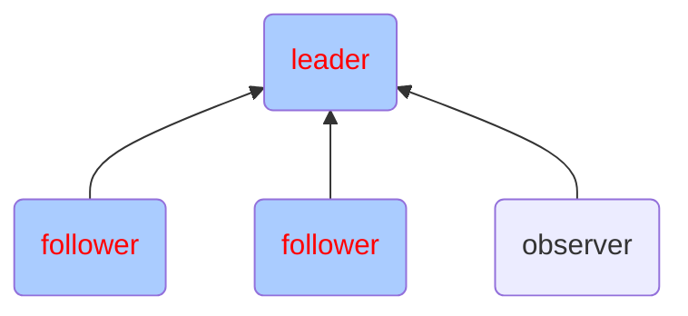

# Hadoop -- 03

## Hadoop集群及组件

#### zookeeper集群图例




#### zookeeper集群

###### 集群安装

1、重启云主机 hadoop1,node-0001,node-0002,node-0003

2、在 hadoop1 上安装配置 zookeeper，并同步给其他主机

拷贝云盘 public/hadoop/zookeeper-3.4.13.tar.gz 到hadoop1

```shell
[root@hadoop1 ~]# yum install -y java-1.8.0-openjdk-devel
[root@hadoop1 ~]# tar zxf zookeeper-3.4.13.tar.gz
[root@hadoop1 ~]# mv zookeeper-3.4.13 /usr/local/zookeeper
[root@hadoop1 ~]# cd /usr/local/zookeeper/conf/
[root@hadoop1 conf]# cp zoo_sample.cfg zoo.cfg
[root@hadoop1 conf]# vim zoo.cfg
# 配置文件最后添加
server.1=node-0001:2888:3888
server.2=node-0002:2888:3888
server.3=node-0003:2888:3888
server.4=hadoop1:2888:3888:observer
[root@hadoop1 ~]# for i in node-{0001..0003};do
                      rsync -aXSH --delete /usr/local/zookeeper ${i}:/usr/local/
                  done
```

所有节点手工启动服务

```shell
[root@hadoop1 ~]# mkdir /tmp/zookeeper
[root@hadoop1 ~]# grep -Po "\d+(?==${HOSTNAME})" /usr/local/zookeeper/conf/zoo.cfg >/tmp/zookeeper/myid
[root@hadoop1 ~]# /usr/local/zookeeper/bin/zkServer.sh start
[root@hadoop1 ~]# jps
1001 QuorumPeerMain
```

当所有节点启动完成以后使用命令验证:

`/usr/local/zookeeper/bin/zkServer.sh status`


#### kafka集群


#### Hadoop高可用集群

