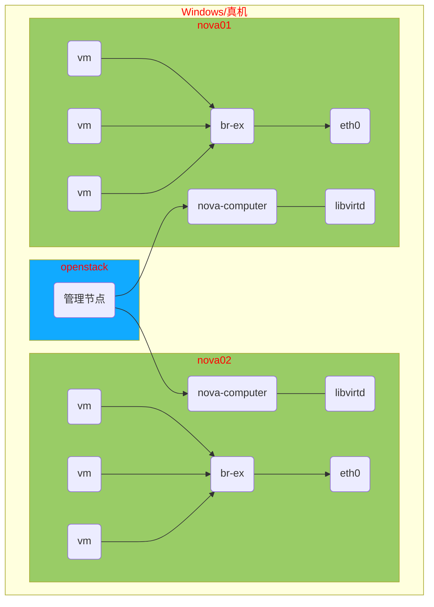

# openstack 安装

## 环境准备
openstack 主机
IP:192.168.1.10 内存:8G CPU:2 硬盘最小10G

nova 主机（nova01, nova02）
IP:192.168.1.11 内存:3G CPU:2 硬盘最小10G
IP:192.168.1.12 内存:3G CPU:2 硬盘最小10G

功能服务器 repo
IP:192.168.1.250 内存:1G CPU:2 硬盘最小20G
上传 RHEL7-extras.iso、RHEL7OSP-10.iso 到功能服务器

## 功能服务器安装配置

#### 时间源服务器

```shell
[root@repo ~]# yum install -y chrony
[root@repo ~]# vim /etc/chrony.conf
# 注释掉所有 server 开头的行，添加
server ntp.aliyun.com iburst
bindacqaddress 0.0.0.0
allow 0/0
local stratum 10
[root@repo ~]# systemctl enable chronyd
[root@repo ~]# systemctl restart chronyd
[root@repo ~]# ss -ltun  # 查看 123 端口是否被监听成功
```

#### 网络yum源服务器

```shell
[root@localhost ~]# yum install -y vsftpd
[root@localhost ~]# systemctl enable --now vsftpd
[root@localhost ~]# mkdir -p /var/ftp/{extras,openstack}
[root@localhost ~]# cd /var/iso
[root@localhost ~]# mount -t iso9660 -o ro,loop RHEL7-extras.iso /var/ftp/extras
[root@localhost ~]# mount -t iso9660 -o ro,loop RHEL7OSP-10.iso /var/ftp/openstack
# 在openstack上验证
[root@openstack ~]# curl ftp://192.168.1.250/
```

#### openstack 实验架构图例



#### openstack系统环境安装配置