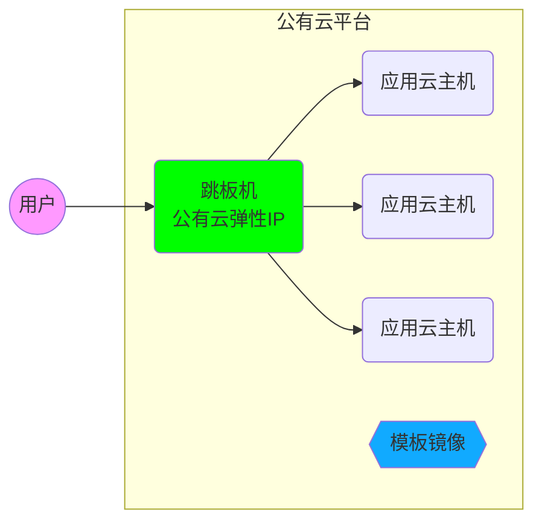

# 公有云 --- 华为云

## 云平台部署管理架构图

```mermaid
graph LR
  subgraph L1[公有云平台]
    P(跳板机<br>公有云弹性IP)
    style P fill:#00ff00
    P --> A1(应用云主机)
    P --> A2(应用云主机)
    P --> A3(应用云主机)
    M{{模板镜像}}
    style M fill:#11aaff
  end
U((用户)) --> P
style U fill:#ff99ff
```

## 共有云配置

区域： 同一个区域中的云主机是可以互相连通的，不通区域云主机是不能使用内部网络互相通信的

选择离自己比较近的区域，可以减少网络延时卡顿

## 跳板机配置

## 模板镜像配置

