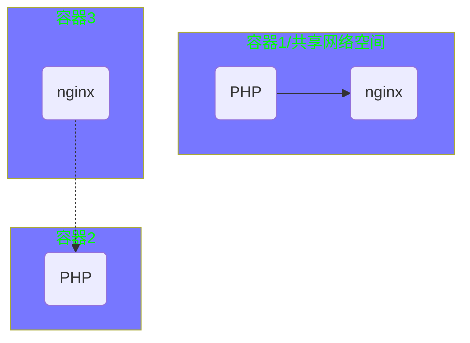
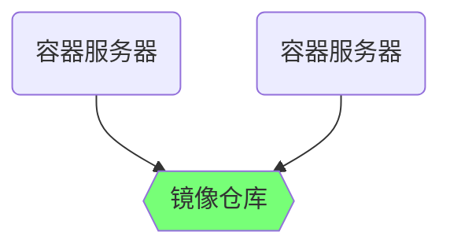

# 容器技术 -- 2

## 镜像管理

#### commit 打包镜像

docker  commit  容器id  新镜像名称:标签

```shell
[root@node-0001 ~]# docker run -it centos:latest
[root@02fd1719c038 ~]# rm -f /etc/yum.repos.d/*.repo
[root@02fd1719c038 ~]# curl -o /etc/yum.repos.d/CentOS-Base.repo http://mirrors.myhuaweicloud.com/repo/CentOS-Base-7.repo
[root@02fd1719c038 ~]# yum install -y net-tools vim-enhanced tree bash-completion iproute psmisc && yum clean all
[root@02fd1719c038 ~]# exit
[root@node-0001 ~]# docker commit 02fd1719c038 myos:latest
```


------






