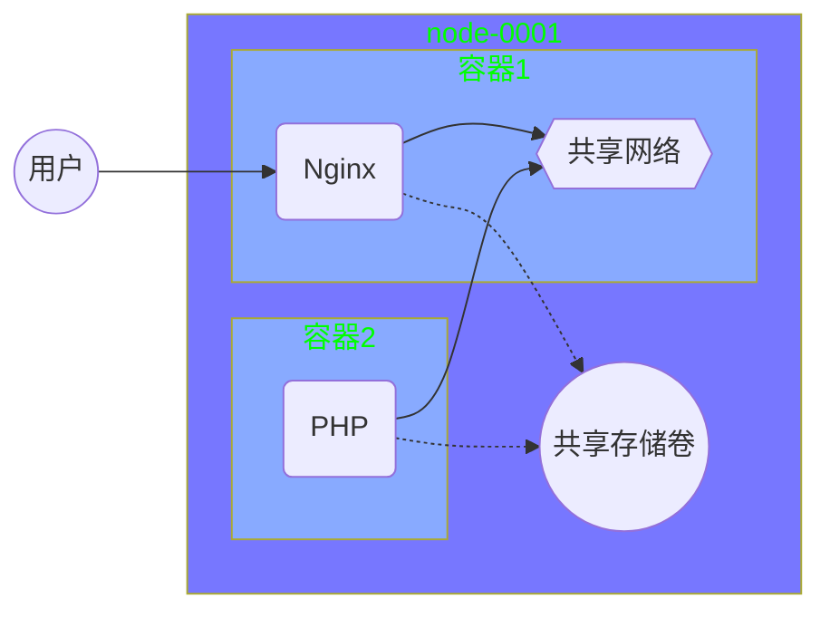
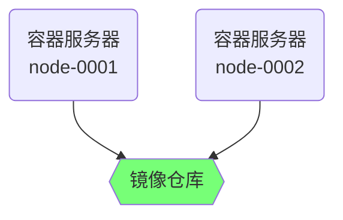

# 容器技术 -- 2

## 镜像管理

#### commit 打包镜像

docker  commit  容器id  新镜像名称:标签

```shell
[root@node-0001 ~]# docker run -it centos:latest
[root@02fd1719c038 ~]# rm -f /etc/yum.repos.d/*.repo
[root@02fd1719c038 ~]# curl -o /etc/yum.repos.d/CentOS-Base.repo http://mirrors.myhuaweicloud.com/repo/CentOS-Base-7.repo
[root@02fd1719c038 ~]# yum install -y net-tools vim-enhanced tree bash-completion iproute psmisc && yum clean all
[root@02fd1719c038 ~]# exit
[root@node-0001 ~]# docker commit 02fd1719c038 myos:latest
```

###### Dockerfile语法

| 语法指令 | 语法说明                              |
| -------- | ------------------------------------- |
| FROM     | 基础镜像                              |
| RUN      | 制作镜像时执行的命令，可以有多个      |
| ADD      | 复制文件到镜像，自动解压              |
| COPY     | 复制文件到镜像，不解压                |
| EXPOSE   | 声明开放的端口                        |
| ENV      | 设置容器启动后的环境变量              |
| WORKDIR  | 定义容器默认工作目录（等于cd）        |
| CMD      | 容器启动时执行的命令，仅可以有一条CMD |

###### 使用Dockerfile创建镜像

**docker  build  -t  镜像名称:标签  Dockerfile所在目录**

###### 制作 myos:python 镜像

```dockerfile
[root@node-0001 ~]# mkdir mybuild
[root@node-0001 ~]# cd mybuild
[root@node-0001 mybuild]# vim Dockerfile
FROM centos:latest
RUN  rm -f /etc/yum.repos.d/*.repo
COPY CentOS-Base.repo local.repo /etc/yum.repos.d/
RUN  yum install -y net-tools vim-enhanced tree bash-completion iproute psmisc && yum clean all
CMD  ["/usr/bin/python"]
[root@node-0001 mybuild]# cp /etc/yum.repos.d/*.repo ./
[root@node-0001 mybuild]# docker build -t myos:python .
```

###### 制作apache镜像

CMD  指令可以查看 service 文件的启动命令 ExecStart（/lib/systemd/system/httpd.service）

ENV  环境变量查询服务文件中的环境变量配置文件 EnvironmentFile 指定的文件内容

```dockerfile
[root@node-0001 ~]# mkdir web; cd web
[root@node-0001 web]# vim Dockerfile
FROM myos:latest
RUN  yum install -y httpd php
ENV  LANG=C
ADD  webhome.tar.gz  /var/www/html/
WORKDIR /var/www/html/
EXPOSE 80
CMD ["/usr/sbin/httpd", "-DFOREGROUND"]
# 拷贝 webhome.tar.gz 到当前目录中
[root@node-0001 web]# docker build -t myos:httpd .
```

查看与验证镜像

```shell
[root@node-0001 web]# docker images
REPOSITORY          TAG                 IMAGE ID            CREATED             SIZE
myos                httpd               db15034569da        12 seconds ago      412MB
myos                python              1739313b5b75        About an hour ago   281MB
myos                latest              867409e412c8        2 hours ago         281MB
[root@node-0001 web]# docker rm -f $(docker ps -aq)
[root@node-0001 web]# docker run -itd myos:httpd
[root@node-0001 web]# curl http://172.17.0.2/info.php
<pre>
Array
(
    [REMOTE_ADDR] => 172.17.0.1
    [REQUEST_METHOD] => GET
    [HTTP_USER_AGENT] => curl/7.29.0
    [REQUEST_URI] => /info.php
)
php_host: 	6c9e124bee1a
1229
```

###### 对外发布服务

给他 node-0001 绑定一个公网IP

docker  run  -itd  -p 宿主机端口:容器端口  镜像名称:标签

```shell
# 把 node-0001 变成 apache 服务
[root@node-0001 ~]# docker run -itd -p 80:80 myos:httpd

# 把 node-0001 变成 nginx 服务，首先必须停止 apache
[root@node-0001 ~]# docker stop $(docker ps -q)
[root@node-0001 ~]# docker run -itd -p 80:80 nginx:latest
```

验证方式： 通过浏览器访问即可

容器共享卷

–docker  run  -itd  -v 宿主机对象:容器内对象  镜像名称:标签

```shell
[root@node-0001 ~]# docker rm -f $(docker ps -aq)
# 创建 apache 容器
[root@node-0001 ~]# docker run -itd myos:httpd
# 创建目录，并拷贝 httpd.conf 配置文件
[root@node-0001 ~]# mkdir /var/{webroot,webconf}
# 查看容器id，使用自己的容器id
[root@node-0001 ~]# docker ps
[root@node-0001 ~]# docker cp 2422cc74d7b6:/etc/httpd/conf/httpd.conf /var/webconf/
# 设置默认首页
[root@node-0001 ~]# echo "i am apache" >>/var/webroot/index.html
# 修改配置文件的监听端口
[root@localhost ~]# vim /etc/httpd/conf/httpd.conf
Listen 8080
# 启动容器，映射 80端口到8080，映射配置文件 /var/webconf/httpd.conf 映射数据目录 /var/webroot
[root@localhost ~]# docker run -itd -p 80:8080 \
                               -v /var/webconf/httpd.conf:/etc/httpd/conf/httpd.conf \
                               -v /var/webroot:/var/www/html myos:httpd
```

验证方式： 通过浏览器访问即可

###### 制作php-fpm镜像

```shell
[root@node-0001 ~]# 
```

###### 制作nginx镜像

```shell
[root@node-0001 ~]# 
```

#### 综合实验Nginx-PHP动静分离

###### 实验架构图例



###### 实验步骤

```shell
[root@node-0001 ~]# 
```


#### docker私有仓库

###### docker私有仓库图例



###### 私有仓库配置

```shell
[root@registry ~]#
```

###### docker客户端配置

```shell
[root@node-0001 ~]#
```

###### 验证测试

```shell
[root@node-0002 ~]#
```

