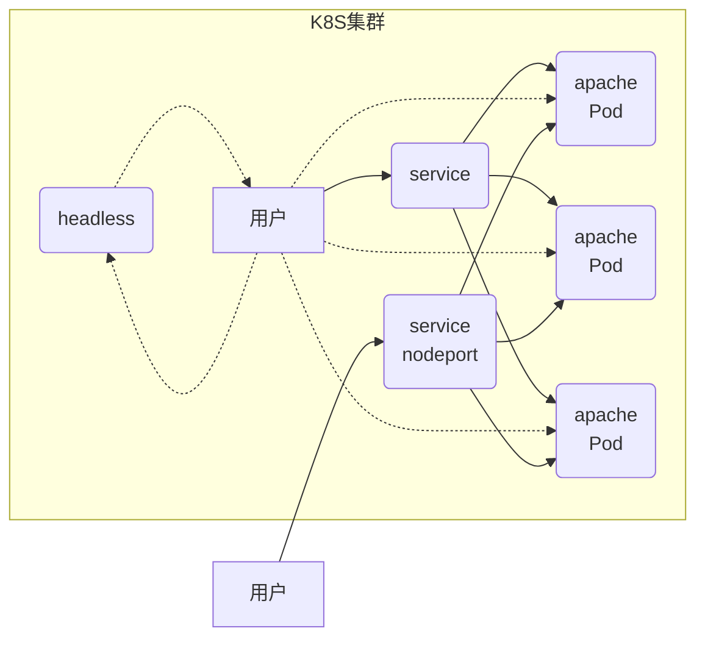

# kubernetes -- 03
## 服务与卷

#### 服务基础

###### 服务图例




###### 创建后端 

```yaml
[root@master config]# cat apache-example.yaml 
---
apiVersion: apps/v1
kind: Deployment
metadata:
  name: apache-example
spec:
  selector:
    matchLabels:
      app: myapp-apache
  replicas: 1
  template:
    metadata:
      labels:
        app: myapp-apache
    spec:
      containers:
      - name: apache
        image: 192.168.1.100:5000/myos:httpd
        ports:
        - protocol: TCP
          containerPort: 80
      restartPolicy: Always
[root@master config]# kubectl apply -f apache-example.yaml
[root@master config]# kubectl get pod
NAME                              READY   STATUS    RESTARTS   AGE
apache-example-65fb568b4c-p6mrl   1/1     Running   0          4m6s
```

###### 创建服务

```yaml
[root@master config]# cat service-example.yaml 
---
apiVersion: v1
kind: Service
metadata:
  name: apache-service
spec:
  ports:
  - protocol: TCP
    port: 80
    targetPort: 80
  selector:
    app: myapp-apache
  type: ClusterIP
[root@master config]# kubectl apply -f service-example.yaml
[root@master config]# kubectl get service
NAME             TYPE        CLUSTER-IP      EXTERNAL-IP   PORT(S)   AGE
apache-service   ClusterIP   10.254.78.148   <none>        80/TCP    9m46s
```

访问服务

服务只有在集群内部才可以访问，创建 Pod，在Pod 中访问服务

```yaml
[root@master config]# cat pod-example.yaml 
apiVersion: v1
kind: Pod
metadata:
  name: pod-example
  labels:
    app: myapp
spec:
  containers:
  - name: myos
    image: 192.168.1.100:5000/myos:v1804
    stdin: true
    tty: true
  restartPolicy: Always
[root@master config]# kubectl apply -f pod-example.yaml
[root@master config]# kubectl exec -it pod-example -- /bin/bash
[root@pod-example /]# curl http://10.254.78.148/info.php
<pre>
Array
(
    [REMOTE_ADDR] => 10.244.3.12
    [REQUEST_METHOD] => GET
    [HTTP_USER_AGENT] => curl/7.29.0
    [REQUEST_URI] => /info.php
)
php_host: 	apache-example-65fb568b4c-thks8
1229
```

扩容集群节点，服务自动扩展

```shell
# 在master上执行扩容节点
[root@master ~]# kubectl scale deployment apache-example --replicas=2
# 服务本质是LVS规则
[root@master ~]# ipvsadm -L -n
TCP  10.254.78.148:80 rr
  -> 10.244.4.66:80               Masq    1      0          0         
  -> 10.244.5.11:80               Masq    1      0          0
-----------------------------------------------------------------------------------------
# 在pod里访问
[root@pod-example /]# curl http://10.254.78.148/info.php
... ...
php_host: 	apache-example-65fb568b4c-p6mrl
... ...
php_host: 	apache-example-65fb568b4c-thks8
```

###### headless服务

```yaml
[root@master ~]# vim headless-service.yaml 
---
apiVersion: v1
kind: Service
metadata:
  name: apache-headless
spec:
  ports:
  - protocol: TCP
    port: 80
    targetPort: 80
  selector:
    app: myapp-apache
  type: ClusterIP
  clusterIP: None
[root@master ~]# kubectl apply -f headless-service.yaml 
service/apache-headless created
[root@master ~]# kubectl get service
NAME              TYPE        CLUSTER-IP      EXTERNAL-IP   PORT(S)   AGE
apache-headless   ClusterIP   None            <none>        80/TCP    5s
apache-service    ClusterIP   10.254.78.148   <none>        80/TCP    74m
kubernetes        ClusterIP   10.254.0.1      <none>        443/TCP   2d20h
#-----------------------------------进入pod查看解析结果------------------------------------
[root@master ~]# kubectl exec -it pod-example -- /bin/bash
[root@pod-example /]# yum install -y bind-utils
[root@pod-example /]# dig -t all apache-headless.default.svc.cluster.local
... ...
;; ANSWER SECTION:
apache-headless.default.svc.cluster.local. 30 IN A 10.244.5.11
apache-headless.default.svc.cluster.local. 30 IN A 10.244.4.66
```

###### nodeport服务

```yaml
[root@master ~]# vim nodeport-example.yaml 
---
apiVersion: v1
kind: Service
metadata:
  name: apache-service1
spec:
  ports:
  - protocol: TCP
    port: 80
    targetPort: 80
  selector:
    app: myapp-apache
  type: NodePort
[root@master ~]# kubectl apply -f nodeport-example.yaml 
[root@master ~]# kubectl get service
NAME              TYPE        CLUSTER-IP      EXTERNAL-IP   PORT(S)        AGE
apache-service1   NodePort    10.254.24.100   <none>        80:31410/TCP   7m10s
#---------------------------所有node节点31410端口均可访问-----------------------------------
# 在跳板机上访问服务
[root@ecs-proxy ~]# curl http://192.168.1.31:31410/info.php
[root@ecs-proxy ~]# curl http://192.168.1.32:31410/info.php
[root@ecs-proxy ~]# curl http://192.168.1.33:31410/info.php
```

###### ingress控制器

拷贝云盘 kubernetes/v1.17.6/ingress 文件夹到 master 上，导入镜像到私有仓库

```yaml
[root@master ingress]# docker load -i ingress-nginx.tar.gz
[root@master ingress]# docker tag quay.io/kubernetes-ingress-controller/nginx-ingress-controller:0.30.0 192.168.1.100:5000/nginx-ingress-controller:0.30.0
[root@master ingress]# docker push 192.168.1.100:5000/nginx-ingress-controller:0.30.0
[root@master ingress]# curl http://192.168.1.100:5000/v2/_catalog
{"repositories":["coredns","etcd","flannel","kube-apiserver","kube-controller-manager","kube-proxy","kube-scheduler","myos","nginx-ingress-controller","pause"]}
```

安装控制器

```shell
[root@master ~]# vim ingress/mandatory.yaml 
221:  image: 192.168.1.100:5000/nginx-ingress-controller:0.30.0
[root@master ~]# kubectl apply -f ingress/mandatory.yaml 
[root@master ~]# kubectl -n ingress-nginx get pod
NAME                                      READY   STATUS    RESTARTS   AGE
nginx-ingress-controller-fc6766d7-ptppp   1/1     Running   0          47s
[root@master ~]# vim ingress/ingress-service.yaml
---
kind: Service
apiVersion: v1
metadata:
  name: ingress-nginx
  namespace: ingress-nginx
  labels:
    app.kubernetes.io/name: ingress-nginx
    app.kubernetes.io/part-of: ingress-nginx
spec:
  externalTrafficPolicy: Local
  type: LoadBalancer
  externalIPs:
  - 192.168.1.101
  selector:
    app.kubernetes.io/name: ingress-nginx
    app.kubernetes.io/part-of: ingress-nginx
  ports:
    - name: http
      port: 80
      protocol: TCP
      targetPort: http
    - name: https
      port: 443
      protocol: TCP
      targetPort: https
[root@master ~]# kubectl apply -f ingress/ingress-service.yaml 
service/ingress-nginx created
[root@master ~]# kubectl -n ingress-nginx get service
NAME            TYPE           CLUSTER-IP       EXTERNAL-IP     PORT(S)                   
ingress-nginx   LoadBalancer   10.254.152.162   192.168.1.101   80:30143/TCP,443:31025/TCP
[root@master ingress]# vim ingress-example.yaml 
---
apiVersion: extensions/v1beta1
kind: Ingress
metadata:
  name: my-app
  annotations:
    kubernetes.io/ingress.class: "nginx"
spec:
  backend:
    serviceName: apache-service
    servicePort: 80
[root@master ingress]# kubectl apply -f ingress-example.yaml
[root@master ingress]# kubectl get ingresses
NAME     HOSTS   ADDRESS        PORTS   AGE
my-app   *       192.168.1.33   80      3m2s
#----------------------- 在跳板机访问测试 -------------------------------------------------
[root@ecs-proxy ~]# curl http://192.168.1.33/info.php
<pre>
Array
(
    [REMOTE_ADDR] => 10.244.3.0
    [REQUEST_METHOD] => GET
    [HTTP_USER_AGENT] => curl/7.29.0
    [REQUEST_URI] => /info.php
)
php_host: 	apache-example-65fb568b4c-p6mrl
1229
```

